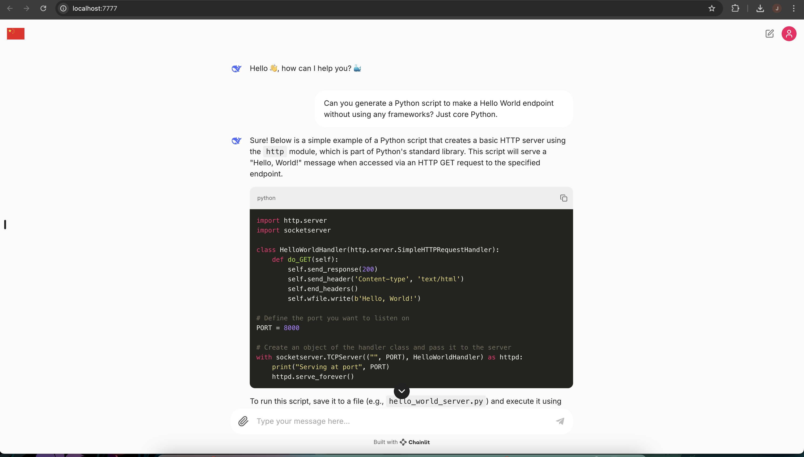

# DeepSeek Coder v2 - Local Implementation 🐳 🇨🇳 

Local Implementation of the DeepSeek Coder v2 model using Ollama and Chainlit.

## 📚 Prerequisites 
- Ollama 
- Python

## ⚙️ Installation and Processing
1. Install DeepSeek Coder v2 from Ollama [here](https://ollama.com/library/deepseek-coder-v2)
2. Install all the requirements running: `pip install -r requirements.txt`
3. Run the app! `chainlit run app.py --port 7777`

## 🤖 Demo 
